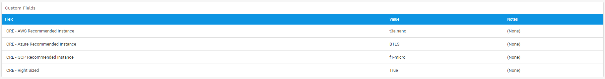

# d42-cf_templates
Define custom field templates to create/update custom fields for various CI's in Device42.

- [Changelog](#changelog)
- [Features](#features)
- [Requirements](#requirements)
- [How to Use](#how-to-use)
- [How it Works](#how-it-works)
- [Example Output](#example-output)

# Changelog
## Patch 0.02 | 2021-08-17
m-e-w: Updated license agreement. 

## Patch 0.01 | 2021-04-03
m-e-w: Added support for dynamic fields (Use column names to assign custom field values)

m-e-w: Added support for bulk_fields (Speeds up requests)

m-e-w: Added option to import saved doql queries in template_doql (Posts saved doql queries)

# Features
- Automatically create/update custom fields for various CI types.
- Create templates to apply groups of custom fields using the response of Saved DOQL Queries as input.
- Dynamic fields (Specify column vales from DOQL to use as custom field values)

# Requirements
- Python 3.6.9 or > 
    - PyYAML==5.4.1
    - requests==2.25.1
- Device42 MA 16.22.00.1612807182 or >

# How to Use
## cd to d42-cf_templates and Create a new virtualenv 

    venv venv

OR

    python3 -m venv venv

## Activate the virtual environment

    source venv/bin/activate

## Install requirements

    pip install -r requirements.txt

## Rename config.yaml.example to config.yaml and fill out the required fields

## Replace example templates in templates.yaml with your own
Example templates are included in the example_templates folder. Just copy the contents of one or more templayes to the templates.yaml in the root directory or use the default.  

Also be aware that this script relies on calling Saved DOQL Queries -- Example queries to go with the templates are located in the templates_doql folder. Set import_doql to true to import them.  
**Note, PUTS to Saved DOQL Queries are not possible at this time -- If the queries supplied in this repository change, you will need to delete them prior to running in order to update them with the latest DOQL.**

## Run 

    python starter.py

## Schedule via cron
In crontab add a line like the following to set your command execution schedule:

    0 0 * * * python /home/your_user_here/d42-apptemplates/starter.py

This will run the script every night at midnight.

# How it Works
## Example template
**IMPORTANT: Saved DOQL queries NEED to exist in the instance first prior to running**

    CRE_RU_ALL: -- Name of the template (Has no bearing, just for labeling)
      ci_type: 'device' -- Type of object in Device42
      unique_id: 'device_fk' -- PK/FK of the object
      saved_doql: 'cre_ru_all' -- Saved DOQL query to run (Requires the query to exist in the instance)
      custom_fields: -- Define a list of custom fields to create/update
        CRE - AWS Recommended Instance: -- Custom Field Name
          type: 'text' -- Type of custom field (Only considered if bulk_fields is not used)
          value: '$instance_aws' -- Custom Field value -- Can be a static value or a column name in the query results
          filterable: 'yes' -- Does it show as a filter in the UI? -- (Only considered if bulk_fields is not used)

In the above example, the script will query Device42 for a saved doql query with the name 'cre_ru_all'. It will then iterate through all rows in the response data and either post all custom fields as bulk_fields (String of key:values seperated by commas) or it will post each custom field individually (Much slower but allows for other custom field types and parameters). 

# Example Output

    Loading template: CRE_RU_ALL

    Calling saved DOQL query: cre_ru_all
            Payload: {'device_id': 5555, 'bulk_fields': 'CRE - AWS Recommended Instance:t3a.nano,CRE - Azure Recommended Instance:F1s,CRE - GCP Recommended Instance:f1-micro,CRE - Right Sized:True'}
            Put:    /api/1.0/device/custom_field/   Response: {'msg': ['custom key pair values added or updated', 5555, 'debian-85-001.device42.pvt', False, False], 'code': 0}
            Payload: {'device_id': 5564, 'bulk_fields': 'CRE - AWS Recommended Instance:t3a.nano,CRE - Azure Recommended Instance:B1LS,CRE - GCP Recommended Instance:f1-micro,CRE - Right Sized:False'}
            Put:    /api/1.0/device/custom_field/   Response: {'msg': ['custom key pair values added or updated', 5564, 'zabbix-01', False, False], 'code': 0}
            Payload: {'device_id': 5572, 'bulk_fields': 'CRE - AWS Recommended Instance:t3a.micro,CRE - Azure Recommended Instance:B1S,CRE - GCP Recommended Instance:e2-micro,CRE - Right Sized:True'}
            Put:    /api/1.0/device/custom_field/   Response: {'msg': ['custom key pair values added or updated', 5572, 'ubuntu-1404-001.device42.pvt', False, False], 'code': 0}
            Payload: {'device_id': 6170, 'bulk_fields': 'CRE - AWS Recommended Instance:t3a.nano,CRE - Azure Recommended Instance:F1s,CRE - GCP Recommended Instance:f1-micro,CRE - Right Sized:False'}
            Put:    /api/1.0/device/custom_field/   Response: {'msg': ['custom key pair values added or updated', 6170, 'jira-demo-01', False, False], 'code': 0}
            Payload: {'device_id': 7564, 'bulk_fields': 'CRE - AWS Recommended Instance:t3a.medium,CRE - Azure Recommended Instance:F2s v2,CRE - GCP Recommended Instance:e2-medium,CRE - Right Sized:False'}
            Put:    /api/1.0/device/custom_field/   Response: {'msg': ['custom key pair values added or updated', 7564, 'jira-7-dev.device42.pvt', False, False], 'code': 0}
            Payload: {'device_id': 10405, 'bulk_fields': 'CRE - AWS Recommended Instance:t3a.nano,CRE - Azure Recommended Instance:B1LS,CRE - GCP Recommended Instance:f1-micro,CRE - Right Sized:True'}
            Put:    /api/1.0/device/custom_field/   Response: {'msg': ['custom key pair values added or updated', 10405, 's1-mysql-9062.device42.pvt', False, False], 'code': 0}
            Payload: {'device_id': 11982, 'bulk_fields': 'CRE - AWS Recommended Instance:t3a.medium,CRE - Azure Recommended Instance:F2s v2,CRE - GCP Recommended Instance:e2-medium,CRE - Right Sized:True'}
            Put:    /api/1.0/device/custom_field/   Response: {'msg': ['custom key pair values added or updated', 11982, 'ip-10-10-19-177.ec2.internal', False, False], 'code': 0}
            Payload: {'device_id': 11988, 'bulk_fields': 'CRE - AWS Recommended Instance:t3a.micro,CRE - Azure Recommended Instance:F1s,CRE - GCP Recommended Instance:f1-micro,CRE - Right Sized:False'}
            Put:    /api/1.0/device/custom_field/   Response: {'msg': ['custom key pair values added or updated', 11988, 'ip-10-10-39-145.ec2.internal', False, False], 'code': 0}
            Payload: {'device_id': 11995, 'bulk_fields': 'CRE - AWS Recommended Instance:t3a.medium,CRE - Azure Recommended Instance:F2s v2,CRE - GCP Recommended Instance:e2-medium,CRE - Right Sized:False'}
            Put:    /api/1.0/device/custom_field/   Response: {'msg': ['custom key pair values added or updated', 11995, 'ip-10-10-109-69.ec2.internal', False, False], 'code': 0}
            Payload: {'device_id': 11997, 'bulk_fields': 'CRE - AWS Recommended Instance:t3a.micro,CRE - Azure Recommended Instance:F1s,CRE - GCP Recommended Instance:e2-micro,CRE - Right Sized:False'}
            Put:    /api/1.0/device/custom_field/   Response: {'msg': ['custom key pair values added or updated', 11997, 'ip-10-10-97-38.ec2.internal', False, False], 'code': 0}
            Payload: {'device_id': 12134, 'bulk_fields': 'CRE - AWS Recommended Instance:t3a.nano,CRE - Azure Recommended Instance:B1LS,CRE - GCP Recommended Instance:f1-micro,CRE - Right Sized:False'}
            Put:    /api/1.0/device/custom_field/   Response: {'msg': ['custom key pair values added or updated', 12134, 'oracle-901110', False, False], 'code': 0}
            Payload: {'device_id': 13265, 'bulk_fields': 'CRE - AWS Recommended Instance:t3a.medium,CRE - Azure Recommended Instance:F2s v2,CRE - GCP Recommended Instance:e2-medium,CRE - Right Sized:True'}
            Put:    /api/1.0/device/custom_field/   Response: {'msg': ['custom key pair values added or updated', 13265, 'ip-10-10-31-197.ec2.internal', False, False], 'code': 0}
            Payload: {'device_id': 13275, 'bulk_fields': 'CRE - AWS Recommended Instance:t3a.micro,CRE - Azure Recommended Instance:F1s,CRE - GCP Recommended Instance:f1-micro,CRE - Right Sized:False'}
            Put:    /api/1.0/device/custom_field/   Response: {'msg': ['custom key pair values added or updated', 13275, 'ip-10-10-18-82.ec2.internal', False, False], 'code': 0}
            Payload: {'device_id': 13277, 'bulk_fields': 'CRE - AWS Recommended Instance:t3a.micro,CRE - Azure Recommended Instance:F1s,CRE - GCP Recommended Instance:f1-micro,CRE - Right Sized:False'}
            Put:    /api/1.0/device/custom_field/   Response: {'msg': ['custom key pair values added or updated', 13277, 'ip-10-10-127-144.ec2.internal', False, False], 'code': 0}
            Payload: {'device_id': 13278, 'bulk_fields': 'CRE - AWS Recommended Instance:t3a.micro,CRE - Azure Recommended Instance:F1s,CRE - GCP Recommended Instance:f1-micro,CRE - Right Sized:False'}
            Put:    /api/1.0/device/custom_field/   Response: {'msg': ['custom key pair values added or updated', 13278, 'ip-10-10-68-233.ec2.internal', False, False], 'code': 0}
            Payload: {'device_id': 13279, 'bulk_fields': 'CRE - AWS Recommended Instance:t3a.micro,CRE - Azure Recommended Instance:F1s,CRE - GCP Recommended Instance:e2-micro,CRE - Right Sized:False'}
            Put:    /api/1.0/device/custom_field/   Response: {'msg': ['custom key pair values added or updated', 13279, 'ip-10-10-84-68.ec2.internal', False, False], 'code': 0}
            Payload: {'device_id': 13280, 'bulk_fields': 'CRE - AWS Recommended Instance:t3a.large,CRE - Azure Recommended Instance:D2s v4,CRE - GCP Recommended Instance:e2-standard-2,CRE - Right Sized:False'}
            Put:    /api/1.0/device/custom_field/   Response: {'msg': ['custom key pair values added or updated', 13280, 'ip-10-10-79-72.ec2.internal', False, False], 'code': 0}
            Payload: {'device_id': 13281, 'bulk_fields': 'CRE - AWS Recommended Instance:t3a.micro,CRE - Azure Recommended Instance:F1s,CRE - GCP Recommended Instance:e2-micro,CRE - Right Sized:False'}
            Put:    /api/1.0/device/custom_field/   Response: {'msg': ['custom key pair values added or updated', 13281, 'ip-10-10-59-173.ec2.internal', False, False], 'code': 0}
            Payload: {'device_id': 13282, 'bulk_fields': 'CRE - AWS Recommended Instance:t3a.micro,CRE - Azure Recommended Instance:F1s,CRE - GCP Recommended Instance:f1-micro,CRE - Right Sized:False'}
            Put:    /api/1.0/device/custom_field/   Response: {'msg': ['custom key pair values added or updated', 13282, 'ip-10-10-30-92.ec2.internal', False, False], 'code': 0}
            Payload: {'device_id': 13807, 'bulk_fields': 'CRE - AWS Recommended Instance:t3a.micro,CRE - Azure Recommended Instance:B2S,CRE - GCP Recommended Instance:e2-micro,CRE - Right Sized:False'}
            Put:    /api/1.0/device/custom_field/   Response: {'msg': ['custom key pair values added or updated', 13807, 'oracle-90119', False, False], 'code': 0}
            Payload: {'device_id': 13808, 'bulk_fields': 'CRE - AWS Recommended Instance:t3a.nano,CRE - Azure Recommended Instance:F1s,CRE - GCP Recommended Instance:f1-micro,CRE - Right Sized:False'}
            Put:    /api/1.0/device/custom_field/   Response: {'msg': ['custom key pair values added or updated', 13808, 'oracle-90118', False, False], 'code': 0}
            Payload: {'device_id': 13809, 'bulk_fields': 'CRE - AWS Recommended Instance:t3a.micro,CRE - Azure Recommended Instance:F1s,CRE - GCP Recommended Instance:e2-micro,CRE - Right Sized:False'}
            Put:    /api/1.0/device/custom_field/   Response: {'msg': ['custom key pair values added or updated', 13809, 'jenkins-90-11-11.device42.com', False, False], 'code': 0}
            Payload: {'device_id': 14133, 'bulk_fields': 'CRE - AWS Recommended Instance:t2.micro,CRE - Azure Recommended Instance:F1s,CRE - GCP Recommended Instance:e2-micro,CRE - Right Sized:False'}
            Put:    /api/1.0/device/custom_field/   Response: {'msg': ['custom key pair values added or updated', 14133, 'qa-wds-90114', False, False], 'code': 0}
            Payload: {'device_id': 14135, 'bulk_fields': 'CRE - AWS Recommended Instance:t3a.medium,CRE - Azure Recommended Instance:F2s v2,CRE - GCP Recommended Instance:e2-medium,CRE - Right Sized:True'}
            Put:    /api/1.0/device/custom_field/   Response: {'msg': ['custom key pair values added or updated', 14135, 'oracle-90116', False, False], 'code': 0}
            Payload: {'device_id': 14137, 'bulk_fields': 'CRE - AWS Recommended Instance:t3a.medium,CRE - Azure Recommended Instance:F2s v2,CRE - GCP Recommended Instance:e2-medium,CRE - Right Sized:True'}
            Put:    /api/1.0/device/custom_field/   Response: {'msg': ['custom key pair values added or updated', 14137, 'oracle-90117', False, False], 'code': 0}
            Payload: {'device_id': 14139, 'bulk_fields': 'CRE - AWS Recommended Instance:t3a.medium,CRE - Azure Recommended Instance:F2s v2,CRE - GCP Recommended Instance:e2-medium,CRE - Right Sized:True'}
            Put:    /api/1.0/device/custom_field/   Response: {'msg': ['custom key pair values added or updated', 14139, 'oracle-90115', False, False], 'code': 0}
            Payload: {'device_id': 14140, 'bulk_fields': 'CRE - AWS Recommended Instance:t3a.large,CRE - Azure Recommended Instance:D2s v4,CRE - GCP Recommended Instance:e2-standard-2,CRE - Right Sized:False'}
            Put:    /api/1.0/device/custom_field/   Response: {'msg': ['custom key pair values added or updated', 14140, 'wds-901114', False, False], 'code': 0}
            Payload: {'device_id': 16262, 'bulk_fields': 'CRE - AWS Recommended Instance:t2.micro,CRE - Azure Recommended Instance:F1s,CRE - GCP Recommended Instance:e2-micro,CRE - Right Sized:False'}
            Put:    /api/1.0/device/custom_field/   Response: {'msg': ['custom key pair values added or updated', 16262, 'WINDOWS-167U3IP', False, False], 'code': 0}
            Payload: {'device_id': 16273, 'bulk_fields': 'CRE - AWS Recommended Instance:t2.micro,CRE - Azure Recommended Instance:F1s,CRE - GCP Recommended Instance:e2-micro,CRE - Right Sized:False'}
            Put:    /api/1.0/device/custom_field/   Response: {'msg': ['custom key pair values added or updated', 16273, 'WINDOWS-LRT92AE', False, False], 'code': 0}

**Screenshot**  
  

